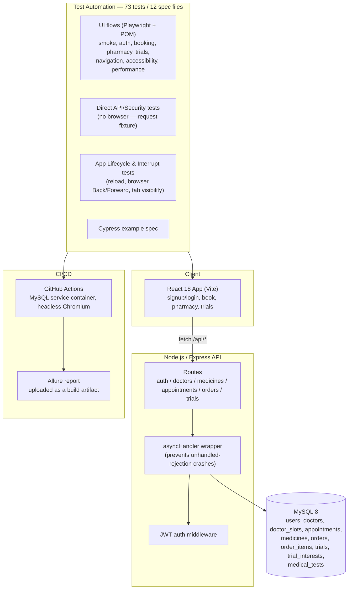

# Meridian Health — Full-Stack QA Automation Portfolio

A complete healthcare demo application — React frontend, Express/MySQL backend — paired
with a from-scratch Playwright automation suite covering signup/login, telehealth
booking, pharmacy checkout, clinical trial matching, direct API/security testing, and
app-lifecycle behavior. Built end-to-end as a QA automation portfolio piece: not just
tests bolted onto someone else's app, but the app, the database schema, the API, and
the test suite all built and debugged together, including a real production bug (a
server crash under error conditions), a genuine CI-only Playwright/DOM race condition,
and a real UX gap in how the app handles browser navigation — all found and fixed or
documented along the way.


[](https://github.com/REZAULKARIM2024/MeridianHealth-test-automation/actions/workflows/ci.yml)


**A 30-second look at the app** — signing up, booking a doctor's appointment, adding a
prescription item to the pharmacy cart, and getting matched to a clinical trial, live:


## Table of Contents

- [Overview](#overview)
- [Architecture](#architecture)
- [Features](#features)
- [Tech Stack](#tech-stack)
- [Prerequisites](#prerequisites)
- [Installation](#installation)
- [Configuration](#configuration)
- [Running the Application](#running-the-application)
- [Bulk Demo Data (Optional)](#bulk-demo-data-optional)
- [Project Structure](#project-structure)
- [Database Overview](#database-overview)
- [Testing](#testing)
- [Test Reporting (Allure)](#test-reporting-allure)
- [CI/CD Pipeline](#cicd-pipeline)
- [Test Automation Design Notes](#test-automation-design-notes)
- [Known Issues & QA Findings](#known-issues--qa-findings)
- [Roadmap](#roadmap)
- [License](#license)
- [Contact](#contact)

## Overview

Meridian Health is a small telehealth-style demo app: users sign up, book an
appointment with a doctor, order medicine from a pharmacy (with prescription-upload
gating on Rx items), and get matched to clinical trials by age and condition. Every
flow is backed by a real MySQL database through a real Express API — nothing is
mocked or stubbed, so the automation suite is exercising the same code path a real
user would hit.

The point of the project is the QA process as much as the app itself: **73 automated
Playwright tests across 12 spec files** — UI flows, direct API/security testing, and
app-lifecycle/browser-navigation behavior — driven through a Page Object Model,
running green in CI on every push. A real production bug, a real CI-only flake, and a
real UX gap were all root-caused and fixed or documented rather than papered over (see
[Known Issues & QA Findings](#known-issues--qa-findings)).

## Architecture



## Features

### Core App
- Signup / login with JWT auth and server-side password hashing.
- Telehealth booking — pick a doctor, pick a time slot, confirm an appointment; booked
  appointments persist to MySQL and show up on the home dashboard.
- Pharmacy — search/browse medicines, add to cart, adjust quantity, checkout with
  shipping + card details; prescription upload is required before checkout completes
  for any Rx-flagged item; out-of-stock items can't be added.
- Clinical trial matching — enter age + condition, get matched trials by eligibility
  range, express interest (idempotent — re-expressing interest doesn't error).
- Responsive mobile/desktop toggle with matching nav patterns (bottom tab bar vs. side
  nav) for the same screens.

### Backend Hardening
- Every route wrapped in an `asyncHandler` so a database error becomes a clean `500`
  JSON response instead of crashing the whole Node process — found during automation
  runs when a real error (bad DB credentials) was taking down the entire server and
  failing every subsequent test in the run, not just the one that hit the error. See
  [Known Issues & QA Findings](#known-issues--qa-findings).
- Process-level `unhandledRejection` / `uncaughtException` listeners as a second line
  of defense on top of the per-route wrapper.

## Tech Stack

| Layer | Technology |
|---|---|
| Frontend | React 18, Vite, Tailwind CSS |
| Backend | Node.js, Express, JWT auth |
| Database | MySQL 8, `mysql2` connection pool |
| E2E Tests | Playwright (TypeScript), Page Object Model |
| Test Reporting | Allure (`allure-playwright`) |
| CI/CD | GitHub Actions — MySQL service container, headless Chromium, Allure + Playwright HTML report artifacts on every push |
| Also included | A Cypress example spec, for comparison |
| Dev tooling | `concurrently` (run API + frontend together), `vite preview` for a production-build test target |

## Prerequisites

- Node.js 18+ and npm
- MySQL 8.x running locally (or reachable over the network)
- A modern browser (Playwright installs its own Chromium/Firefox/WebKit binaries)

## Installation

1. **Clone the repository**
   ```bash
   git clone https://github.com/REZAULKARIM2024/MeridianHealth-test-automation.git
   cd MeridianHealth-test-automation
   ```
2. **Create the MySQL app user and database** (run once, as root):
   ```sql
   CREATE USER 'meridian'@'%' IDENTIFIED BY 'meridian_dev_pw';
   CREATE DATABASE IF NOT EXISTS meridian_health;
   GRANT ALL PRIVILEGES ON meridian_health.* TO 'meridian'@'%';
   FLUSH PRIVILEGES;
   ```
3. **Install dependencies** (root app + server, from the project root):
   ```bash
   npm install
   npm install --prefix server
   ```
4. **Install Playwright's browser binaries** (first time only):
   ```bash
   npx playwright install
   ```

## Configuration

Copy `server/.env.example` to `server/.env` and fill in real values:

```bash
DB_HOST=127.0.0.1
DB_PORT=3306
DB_USER=meridian
DB_PASSWORD=meridian_dev_pw
DB_NAME=meridian_health
JWT_SECRET=change_this_to_a_long_random_string
PORT=4000
CORS_ORIGIN=http://localhost:5173
```

Generate a real `JWT_SECRET` with:
```bash
node -e "console.log(require('crypto').randomBytes(48).toString('hex'))"
```

## Running the Application

**One-click setup + test run (Windows):** double-click `run-tests.bat`. It creates
`server/.env` with working local defaults if missing, installs dependencies, frees any
stuck ports, initializes the database schema + seed data, builds the app, and runs the
full Playwright suite.

**Manual, step by step:**
```bash
# 1. Seed the database (schema + demo doctors/medicines/trials)
npm run db:init --prefix server

# 2. Run the app in dev mode (API + Vite dev server together)
npm run dev:full
# open http://localhost:5173
```

## Bulk Demo Data (Optional)

For a richer demo, load a large synthetic dataset on top of the base seed:

```bash
mysql -u meridian -pmeridian_dev_pw meridian_health < server/src/bulk_seed.sql
mysql -u meridian -pmeridian_dev_pw meridian_health < server/src/more_medicines.sql
mysql -u meridian -pmeridian_dev_pw meridian_health < server/src/medical_tests.sql
```

This adds:

| Data | Count | Notes |
|---|---|---|
| Patients (`users`) | 500 | Unique names/emails (`patient1@meridianmail.test` … `patient500@…`); all share the password `Demo1234!` |
| Doctors | 300 | Across 25 medical specialties, 4 time slots each (1,200 slots total) |
| Medicines | 1,500 | Realistic generic-drug-name/strength/form combinations, all unique, ~1/3 Rx-required |
| Medical tests | 200 | New `medical_tests` table — diagnostic/lab tests across Blood, Imaging, Cardiac, Urine/Stool, Pulmonary, and Other categories |

All three files use `INSERT IGNORE`, so they're safe to re-run without creating
duplicates. Every row was validated by actually running the SQL against a real MySQL
instance and checking row counts/uniqueness before being committed — not just
generated and assumed correct.

**Note:** `medical_tests` is currently data-only — there's no app UI or API route for
it yet (no "Tests" tab, no booking flow). It's ready for that feature to be built on
top of it.

## Project Structure

```
meridian-tests/
  src/
    MeridianHealthApp.jsx   React app — all screens, all data-testid attrs
    api.js                  fetch client, proxies /api/* to the backend
    main.jsx, index.css     Vite entry point + Tailwind
  server/
    src/
      schema.sql            8 tables (see Database Overview)
      seed.sql               idempotent demo data — 4 doctors, 6 medicines, 4 trials
      bulk_seed.sql          500 patients, 300 doctors, 500 medicines (optional)
      more_medicines.sql     +1000 more medicines, bringing the catalog to 1500 (optional)
      medical_tests.sql      new medical_tests table + 200 diagnostic tests (optional)
      initDb.js               `npm run db:init` entry point
      db.js                  mysql2 pool
      asyncHandler.js        wraps every route so DB/API errors can't crash the server
      middleware/auth.js     JWT bearer-token verification
      routes/                auth, doctors, medicines, appointments, orders, trials
      index.js               Express app, listens on :4000
    .env.example
  tests/                     Playwright spec files (TypeScript), 73 tests / 12 files
  pages/                     Page Object Model — AuthPage, NavPage, BookPage,
                              PharmacyPage, TrialsPage
  playwright.config.ts       primary config — serial workers, retries, HTML + Allure reporters
  playwright.dev.config.ts   alternate config for fast dev-mode iteration
  run-tests.bat              one-click Windows setup + test runner
  vite.config.js             dev + preview proxy: /api -> localhost:4000
  .github/workflows/ci.yml   GitHub Actions pipeline
```

## Database Overview

| Table | Purpose |
|---|---|
| `users` | Signup/login accounts |
| `doctors` | Bookable doctors (name, specialty, rating) |
| `doctor_slots` | Available time slots per doctor |
| `appointments` | Booked appointments, linked to `users` + `doctors` |
| `medicines` | Pharmacy catalog, incl. Rx-required flag and stock |
| `orders` / `order_items` | Pharmacy checkout, order line items |
| `trials` | Clinical trials with eligibility age range + condition |
| `trial_interests` | User interest expressions, unique per (user, trial) |
| `medical_tests` | Diagnostic/lab test catalog (data-only — see [Bulk Demo Data](#bulk-demo-data-optional)) |

## Testing

```bash
npm run test:e2e -- --project=chromium
```

This runs the `pretest:e2e` hook first (`vite build`), so tests run against a real
production build served via `vite preview` — not the dev server — which removes
first-request compile latency as a source of flaky timing.

**73 tests across 12 spec files, currently 100% passing in CI:**

| File | Covers |
|---|---|
| `smoke.spec.ts` | App loads, signup, logout, re-login, nav tabs |
| `auth.spec.ts` | Client + server-side validation, negative/data-driven cases |
| `booking.spec.ts` | Happy path, per-doctor data-driven booking, dashboard reflection |
| `pharmacy.spec.ts` | Search, cart, Rx gating, checkout validation, price totals |
| `trials.spec.ts` | Matching, boundary ages, interest expression, empty states |
| `navigation.spec.ts` | Tab routing, back navigation, mobile/desktop layouts |
| `accessibility.spec.ts` | Keyboard navigation, accessible names, focus visibility |
| `performance_and_device.spec.ts` | Load time budget, network-drop tolerance, data reset |
| `api.spec.ts` | Direct HTTP tests against the real backend — no browser (signup, login, doctors, medicines, booking, trial matching) |
| `security.spec.ts` | Unauthorized access, tampered/forged JWTs, SQL-injection and XSS safety |
| `lifecycle.spec.ts` | Session behavior across a reload; browser Back/Forward and tab-visibility "interrupt" tests |
| `debug-booking.spec.ts` | A diagnostic spec (network/console dump) used during development to isolate a timing issue in the booking flow — kept in the suite as a template for future debugging |

Config highlights (`playwright.config.ts`):
- `workers: 1` — serial execution; this local stack (single Node process + single MySQL
  instance) showed real, reproducible contention at higher worker counts, not flaky
  noise. CI runs the same way for consistency with local runs.
- `retries: 2` on top of the fixes below — a safety net for real machine-load variance,
  not a substitute for fixing root causes.
- `expect.timeout: 20_000` — raised from Playwright's 10s default after observing this
  project's full-suite run time vary noticeably across different machines and background
  load.
- `reporter: [["html"], ["allure-playwright"], ["list"]]` — HTML report for local runs,
  Allure results for the richer CI report (see below).

## Test Reporting (Allure)

```bash
npm run test:e2e            # writes raw results to allure-results/
npm run allure:generate     # builds the static report into allure-report/
npm run allure:open         # serves it locally and opens your browser
```

Allure's results are written to `allure-results/` on every test run (via the
`allure-playwright` reporter), separate from Playwright's own built-in HTML report.
Because the generated report is a client-side app that fetches its data as JSON,
**open it over `http://`, not by double-clicking `index.html`** — `npm run allure:open`
handles that for you, or serve `allure-report/` with any static file server.

CI generates and uploads this same report as a build artifact on every push — see
[CI/CD Pipeline](#cicd-pipeline).

## CI/CD Pipeline

`.github/workflows/ci.yml` runs on every push/PR to `main`:

1. Spins up a real **MySQL 8 service container** and creates the `meridian` app user.
2. Installs root + server dependencies, writes a CI-specific `server/.env`.
3. Initializes the database schema + seed data (`npm run db:init`).
4. Installs Playwright's Chromium browser.
5. Runs the full 73-test suite against a production build (`npm run test:e2e --
   --project=chromium`).
6. Uploads three artifacts, even on failure: the Playwright HTML report, raw
   `test-results/` (screenshots, traces, `error-context.md` per failure — this is what
   was used to root-cause the CI-only race and the browser-history finding described
   below), and the generated Allure report.

The badge at the top of this README reflects the latest run. A full CI run — including
spinning up MySQL from scratch — currently completes in 2–3 minutes, compared to
highly variable (1.5 minutes to over an hour) local run times on some Windows machines,
which is what motivated setting this up in the first place: it turned a debugging
environment with too many uncontrolled variables (antivirus scanning, background sync
clients, local MySQL state) into a clean, reproducible one.

## Test Automation Design Notes

A few specific fixes made during development, kept here because they're the kind of
thing worth knowing about rather than hiding:

- **`asyncHandler` on every route** (`server/src/asyncHandler.js`) — Express 4 doesn't
  catch rejected promises from `async` route handlers automatically. Without this
  wrapper, a single failed query (e.g. a transient DB hiccup) becomes an unhandled
  promise rejection that can crash the entire Node process — taking down *every*
  in-flight request, not just the one that failed. This was caught by watching the
  entire suite fail in a cascade after one bad request, not by a single test failure.
- **`aria-pressed` on time-slot buttons** — added both for real accessibility value and
  because it gives the booking Page Object a genuine state signal ("is this slot really
  selected yet?") to wait on before clicking "Book", instead of guessing with a fixed
  delay.
- **Production build for tests, not the dev server** — `vite build` runs once before
  the suite via the `pretest:e2e` npm hook, and Playwright's `webServer` serves that
  build with `vite preview`. Running against the dev server caused real, reproducible
  timeouts on the first test or two per file, from Vite's on-demand module compilation.
- **Text-based DOM waits instead of `getByTestId(...).toBeVisible()` for post-async
  content** — see the CI-only race condition writeup below; this is the concrete fix
  and the reasoning for it.
- **Direct HTTP tests via Playwright's `request` fixture** (`api.spec.ts`,
  `security.spec.ts`) — a UI test can pass because the app quietly hides a bad API
  response; asserting on raw status codes and JSON shape directly catches things a
  browser-driven test wouldn't.

## Known Issues & QA Findings

Documented rather than hidden, as any real QA process would:

- **Resolved — a genuine CI-only race between React's post-fetch render and
  Playwright's `getByTestId(...).toBeVisible()`.** Three independent screens (the
  booking confirmation card, the pharmacy medicine catalog, and search-filtered
  results) all exhibited the same symptom in GitHub Actions: a CI accessibility
  snapshot captured at the exact moment of a timeout showed the correct content
  genuinely rendered on screen (e.g. "Appointment confirmed" / "Dr. Amara Osei · 9:00
  AM", or "Amoxicillin 500mg $12.50"), while `getByTestId(...)` still reported
  "element(s) not found" — even when checking the raw DOM directly via
  `document.querySelector` inside `page.waitForFunction`. Switching those specific
  waits to search the actual rendered *text* instead of the `data-testid` attribute
  (via a `TreeWalker` over text nodes, checking `getClientRects().length > 0` on the
  parent) resolved every instance. This was never reproducible locally — only in
  GitHub Actions' headless Chromium — which is itself a useful data point about why
  CI-only flakes deserve their own investigation rather than being dismissed as "works
  on my machine." Root-caused using the raw `test-results/error-context.md` artifacts
  (accessibility snapshot + exact locator + exact timeout) rather than guesswork.
- **Documented — the app doesn't push browser history state (`INT-01`,
  `tests/lifecycle.spec.ts`).** Since the app manages all navigation via React state
  rather than `pushState`/client-side routing, the browser's history has exactly one
  entry after the initial load. Pressing the browser's **Back** button mid-flow doesn't
  return to a "previous screen" within the app — a CI screenshot captured at the
  moment of the original (incorrect) assertion showed a completely blank page,
  confirming the whole React app had unmounted. Pressing **Forward** afterward
  triggers a fresh reload rather than restoring state, landing back on the login
  screen (consistent with the no-session-persistence finding in `LFC-01`). This is a
  real, minor UX gap worth fixing in the app itself (e.g. adopting a router that
  reflects screens in the URL) — the test now documents the actual behavior rather
  than asserting the originally-assumed, incorrect one.

## Roadmap

- Fix the browser-history gap above by adopting client-side routing, so Back/Forward
  behave the way users expect instead of unmounting the app
- Investigate *why* testid-attribute matching specifically breaks for post-async
  content in GitHub Actions' headless Chromium (a genuine open question — the fix
  above works reliably, but the underlying browser/Playwright-version interaction
  isn't fully explained yet)
- Build an actual UI/API feature on top of the new `medical_tests` data (a "Tests" tab,
  booking flow, and corresponding Playwright coverage)
- Expand the Cypress example into a second full suite for cross-framework comparison
- Add visual regression coverage for the mobile/desktop layout toggle
- Add a scheduled (nightly) CI run in addition to push/PR triggers

## License

Demo/portfolio project — not intended for production use. No real patient, doctor, or
payment data; all data is synthetic and seeded for demonstration purposes only.

## Contact

**Rezaul Karim** — QA Automation Engineer / SDET
📧 rknyc2021@gmail.com

[LinkedIn](https://www.linkedin.com/in/rezaul-karim-803a3b273)
