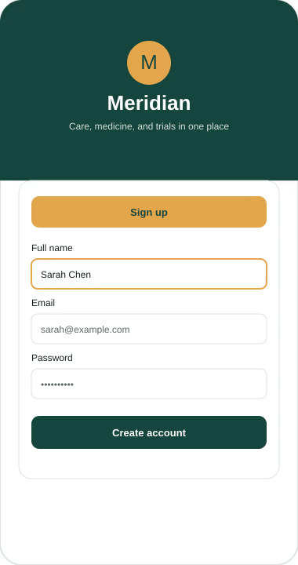
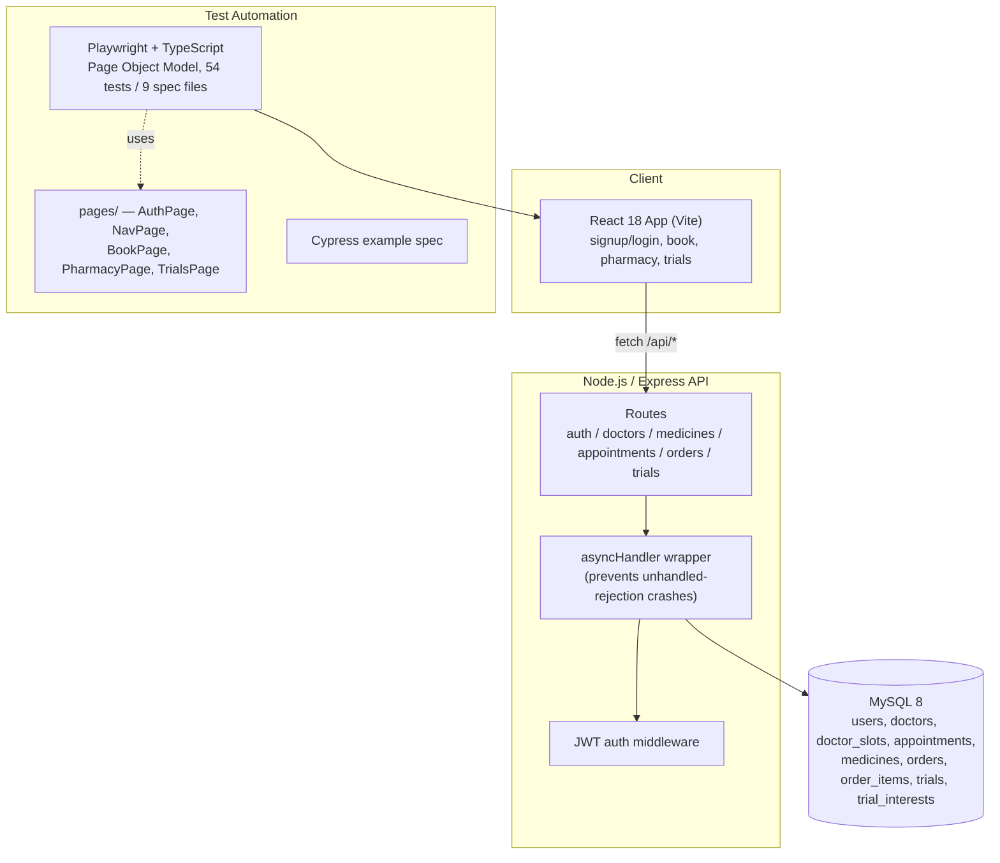

# Meridian Health — Full-Stack QA Automation Portfolio

A complete healthcare demo application — React frontend, Express/MySQL backend — paired
with a from-scratch Playwright automation suite covering signup/login, telehealth
booking, pharmacy checkout, and clinical trial matching. Built end-to-end as a QA
automation portfolio piece: not just tests bolted onto someone else's app, but the app,
the database schema, the API, and the test suite all built and debugged together,
including a real production bug (a server crash under error conditions) found and fixed
along the way.


**A 30-second look at the app** — signing up, booking a doctor's appointment, adding a
prescription item to the pharmacy cart, and getting matched to a clinical trial, live:



## Table of Contents

- [Overview](#overview)
- [Architecture](#architecture)
- [Features](#features)
- [Tech Stack](#tech-stack)
- [Prerequisites](#prerequisites)
- [Installation](#installation)
- [Configuration](#configuration)
- [Running the Application](#running-the-application)
- [Project Structure](#project-structure)
- [Database Overview](#database-overview)
- [Testing](#testing)
- [Test Automation Design Notes](#test-automation-design-notes)
- [Known Issues & QA Findings](#known-issues--qa-findings)
- [Roadmap](#roadmap)
- [License](#license)
- [Contact](#contact)

## Overview

Meridian Health is a small telehealth-style demo app: users sign up, book an
appointment with a doctor, order medicine from a pharmacy (with prescription-upload
gating on Rx items), and get matched to clinical trials by age and condition. Every
flow is backed by a real MySQL database through a real Express API — nothing is
mocked or stubbed, so the automation suite is exercising the same code path a real
user would hit.

The point of the project is the QA process as much as the app itself: 53 mapped test
cases across accessibility, auth, booking, navigation, pharmacy, performance, and
clinical trials, driven through a Page Object Model in Playwright, plus a debug harness
used mid-project to catch and fix a real backend bug (see
[Known Issues & QA Findings](#known-issues--qa-findings)).

## Architecture



## Features

### Core App
- Signup / login with JWT auth and server-side password hashing.
- Telehealth booking — pick a doctor, pick a time slot, confirm an appointment; booked
  appointments persist to MySQL and show up on the home dashboard.
- Pharmacy — search/browse medicines, add to cart, adjust quantity, checkout with
  shipping + card details; prescription upload is required before checkout completes
  for any Rx-flagged item; out-of-stock items can't be added.
- Clinical trial matching — enter age + condition, get matched trials by eligibility
  range, express interest (idempotent — re-expressing interest doesn't error).
- Responsive mobile/desktop toggle with matching nav patterns (bottom tab bar vs. side
  nav) for the same screens.

### Backend Hardening
- Every route wrapped in an `asyncHandler` so a database error becomes a clean `500`
  JSON response instead of crashing the whole Node process — found during automation
  runs when a real error (bad DB credentials) was taking down the entire server and
  failing every subsequent test in the run, not just the one that hit the error. See
  [Known Issues & QA Findings](#known-issues--qa-findings).
- Process-level `unhandledRejection` / `uncaughtException` listeners as a second line
  of defense on top of the per-route wrapper.

## Tech Stack

| Layer | Technology |
|---|---|
| Frontend | React 18, Vite, Tailwind CSS |
| Backend | Node.js, Express, JWT auth |
| Database | MySQL 8, `mysql2` connection pool |
| E2E Tests | Playwright (TypeScript), Page Object Model |
| Also included | A Cypress example spec, for comparison |
| Dev tooling | `concurrently` (run API + frontend together), `vite preview` for a production-build test target |

## Prerequisites

- Node.js 18+ and npm
- MySQL 8.x running locally (or reachable over the network)
- A modern browser (Playwright installs its own Chromium/Firefox/WebKit binaries)

## Installation

1. **Clone the repository**
   ```bash
   git clone https://github.com/<your-username>/meridian-test-automation.git
   cd meridian-test-automation
   ```
2. **Create the MySQL app user and database** (run once, as root):
   ```sql
   CREATE USER 'meridian'@'%' IDENTIFIED BY 'meridian_dev_pw';
   CREATE DATABASE IF NOT EXISTS meridian_health;
   GRANT ALL PRIVILEGES ON meridian_health.* TO 'meridian'@'%';
   FLUSH PRIVILEGES;
   ```
3. **Install dependencies** (root app + server, from the project root):
   ```bash
   npm install
   npm install --prefix server
   ```
4. **Install Playwright's browser binaries** (first time only):
   ```bash
   npx playwright install
   ```

## Configuration

Copy `server/.env.example` to `server/.env` and fill in real values:

```bash
DB_HOST=127.0.0.1
DB_PORT=3306
DB_USER=meridian
DB_PASSWORD=meridian_dev_pw
DB_NAME=meridian_health
JWT_SECRET=change_this_to_a_long_random_string
PORT=4000
CORS_ORIGIN=http://localhost:5173
```

Generate a real `JWT_SECRET` with:
```bash
node -e "console.log(require('crypto').randomBytes(48).toString('hex'))"
```

## Running the Application

**One-click setup + test run (Windows):** double-click `run-tests.bat`. It creates
`server/.env` with working local defaults if missing, installs dependencies, frees any
stuck ports, initializes the database schema + seed data, builds the app, and runs the
full Playwright suite.

**Manual, step by step:**
```bash
# 1. Seed the database (schema + demo doctors/medicines/trials)
npm run db:init --prefix server

# 2. Run the app in dev mode (API + Vite dev server together)
npm run dev:full
# open http://localhost:5173
```

## Project Structure

```
meridian-tests/
  src/
    MeridianHealthApp.jsx   React app — all screens, all data-testid attrs
    api.js                  fetch client, proxies /api/* to the backend
    main.jsx, index.css     Vite entry point + Tailwind
  server/
    src/
      schema.sql            8 tables (see Database Overview)
      seed.sql               idempotent demo data — 4 doctors, 6 medicines, 4 trials
      initDb.js               `npm run db:init` entry point
      db.js                  mysql2 pool
      asyncHandler.js        wraps every route so DB/API errors can't crash the server
      middleware/auth.js     JWT bearer-token verification
      routes/                auth, doctors, medicines, appointments, orders, trials
      index.js               Express app, listens on :4000
    .env.example
  tests/                     Playwright spec files (TypeScript), 54 tests / 9 files
  pages/                     Page Object Model — AuthPage, NavPage, BookPage,
                              PharmacyPage, TrialsPage
  playwright.config.ts       primary config — serial workers, retries, HTML report
  playwright.dev.config.ts   alternate config for fast dev-mode iteration
  run-tests.bat              one-click Windows setup + test runner
  vite.config.js             dev + preview proxy: /api -> localhost:4000
```

## Database Overview

| Table | Purpose |
|---|---|
| `users` | Signup/login accounts |
| `doctors` | Bookable doctors (name, specialty, rating) |
| `doctor_slots` | Available time slots per doctor |
| `appointments` | Booked appointments, linked to `users` + `doctors` |
| `medicines` | Pharmacy catalog, incl. Rx-required flag and stock |
| `orders` / `order_items` | Pharmacy checkout, order line items |
| `trials` | Clinical trials with eligibility age range + condition |
| `trial_interests` | User interest expressions, unique per (user, trial) |

## Testing

```bash
npm run test:e2e -- --project=chromium
```

This runs the `pretest:e2e` hook first (`vite build`), so tests run against a real
production build served via `vite preview` — not the dev server — which removes
first-request compile latency as a source of flaky timing.

54 tests across 9 spec files:

| File | Covers |
|---|---|
| `smoke.spec.ts` | App loads, signup, logout, re-login, nav tabs |
| `auth.spec.ts` | Client + server-side validation, negative/data-driven cases |
| `booking.spec.ts` | Happy path, per-doctor data-driven booking, dashboard reflection |
| `pharmacy.spec.ts` | Search, cart, Rx gating, checkout validation, price totals |
| `trials.spec.ts` | Matching, boundary ages, interest expression, empty states |
| `navigation.spec.ts` | Tab routing, back navigation, mobile/desktop layouts |
| `accessibility.spec.ts` | Keyboard navigation, accessible names, focus visibility |
| `performance_and_device.spec.ts` | Load time budget, network-drop tolerance, data reset |
| `debug-booking.spec.ts` | A diagnostic spec (network/console dump) used during development to isolate a timing issue in the booking flow — kept in the suite as a template for future debugging |

Config highlights (`playwright.config.ts`):
- `workers: 1` — serial execution; this local stack (single Node process + single MySQL
  instance) showed real, reproducible contention at higher worker counts, not flaky
  noise. Raise this once run against a properly resourced runner.
- `retries: 2` on top of the fixes below — a safety net for real machine-load variance,
  not a substitute for fixing root causes.
- `expect.timeout: 20_000` — raised from Playwright's 10s default after observing this
  project's full-suite run time vary from ~1.5 to ~8 minutes on the same machine
  depending on background load.

## Test Automation Design Notes

A few specific fixes made during development, kept here because they're the kind of
thing worth knowing about rather than hiding:

- **`asyncHandler` on every route** (`server/src/asyncHandler.js`) — Express 4 doesn't
  catch rejected promises from `async` route handlers automatically. Without this
  wrapper, a single failed query (e.g. a transient DB hiccup) becomes an unhandled
  promise rejection that can crash the entire Node process — taking down *every*
  in-flight request, not just the one that failed. This was caught by watching the
  entire suite fail in a cascade after one bad request, not by a single test failure.
- **`aria-pressed` on time-slot buttons** — added both for real accessibility value and
  because it gives the booking Page Object a genuine state signal ("is this slot really
  selected yet?") to wait on before clicking "Book", instead of guessing with a fixed
  delay.
- **Production build for tests, not the dev server** — `vite build` runs once before
  the suite via the `pretest:e2e` npm hook, and Playwright's `webServer` serves that
  build with `vite preview`. Running against the dev server caused real, reproducible
  timeouts on the first test or two per file, from Vite's on-demand module compilation.

## Known Issues & QA Findings

Documented rather than hidden, as any real QA process would:

- **`E2E-02` / `DDT-01` (booking confirmation) — investigated with the Playwright trace
  viewer.** The booking API call succeeds (`201`), and a screenshot captured at the
  exact moment of the failing assertion shows the "Appointment confirmed" screen
  correctly rendered on screen — but `getByTestId('appointment-confirmation')` still
  reports "not found" at that instant. This means the app itself is working correctly;
  the remaining gap is in exactly how/when the confirmation element is momentarily
  unavailable to Playwright's query, not a functional defect. Next step: instrument the
  `BookScreen` component's render cycle directly (React DevTools profiler or a targeted
  console log on mount/unmount) rather than guessing further from the outside.
- A handful of pharmacy/trials tests are timing-sensitive on slower machines and were
  given generous explicit waits on real state signals (e.g. "catalog has rendered
  at least one item") rather than arbitrary sleeps — most cases resolved, a few remain
  under investigation using the same trace-driven approach above.

## Roadmap

- Finish root-causing the booking-confirmation timing gap using React-level
  instrumentation rather than black-box waits
- Wire the suite into GitHub Actions CI (currently local-only)
- Add an HTML/Allure-style report artifact upload on CI runs
- Expand the Cypress example into a second full suite for cross-framework comparison
- Add visual regression coverage for the mobile/desktop layout toggle

## License

Demo/portfolio project — not intended for production use. No real patient, doctor, or
payment data; all data is synthetic and seeded for demonstration purposes only.

## Contact

**Rezaul Karim** — QA Automation Engineer / SDET
📧 rknyc2021@gmail.com

[LinkedIn](https://www.linkedin.com/in/rezaul-karim-803a3b273)# Meridian Health — Full-Stack QA Automation Project

A runnable Vite + React app (`MeridianHealthApp.jsx`) backed by a real
**Express + MySQL** API (`server/`), plus a Playwright test suite (primary)
and one Cypress example file — all driven by stable `data-testid` selectors
in the component.

Data is no longer local-only mock state: accounts, appointments, orders, and
trial interest all persist in MySQL through the API.

## 1. Set up MySQL

You need a MySQL (or MySQL-compatible, e.g. MariaDB) server running locally,
or point at a remote one.

```bash
# macOS (Homebrew)
brew install mysql && brew services start mysql

# Ubuntu/Debian
sudo apt-get install mysql-server && sudo service mysql start

# Or Docker, if you'd rather not install it locally:
docker run --name meridian-mysql -e MYSQL_ALLOW_EMPTY_PASSWORD=yes -p 3306:3306 -d mysql:8
```

Then create an app-level user (don't use root in the app itself):

```sql
CREATE USER 'meridian'@'%' IDENTIFIED BY 'meridian_dev_pw';
GRANT ALL PRIVILEGES ON meridian_health.* TO 'meridian'@'%';
FLUSH PRIVILEGES;
```

## 2. Configure and install the backend

```bash
cd server
cp .env.example .env      # edit DB_USER/DB_PASSWORD to match what you created above
npm install
npm run db:init           # creates the schema and seeds doctors/medicines/trials
```

## 3. Run everything

```bash
# from the project root
npm install
npm run dev:full           # starts both the API (port 4000) and the app (port 5173)
```

Or run them separately in two terminals if you prefer:

```bash
npm start --prefix server   # API on :4000
npm run dev                 # app on :5173, proxies /api/* to :4000 (see vite.config.js)
```

Open http://localhost:5173 — sign up for a new account (login requires an
account that already exists, since this is now a real database, not a
"any credentials work" demo).

## 4. Run the Playwright suite

```bash
npm run test:e2e          # builds the app, then runs headless against the production build
npm run test:e2e:headed   # same, but watch it run in a real browser window
npm run test:e2e:ui       # Playwright's interactive UI runner — best for debugging
npm run test:e2e:dev      # runs against the DEV server instead (faster start, but can be flaky right after a cold start — see below)
```

`npm run test:e2e` runs a `pretest:e2e` hook (`vite build`) first, then starts both
the API and a `vite preview` server serving that build (`npm run serve:full`),
and only then runs the tests. This avoids a real issue we hit running against
the dev server: Vite's dev server compiles each module on its first request,
which caused genuine, reproducible timeouts on the first test or two right
after a fresh `dev:full` start — confirmed via a debug script showing the
booking flow working perfectly once the server had already handled a few
requests. Using the production build removes that cold-start window entirely,
since everything is pre-compiled before any test runs.

`test:e2e:dev` is kept around for quick iteration on a single test while
actively writing it (faster to start, no build step) — just don't rely on it
for a full clean run.

**Important:** don't have `npm run dev:full` running in another terminal at
the same time as `npm run test:e2e` — both bind port 5173, they'll conflict.

`playwright.config.ts`'s `webServer` handles starting everything for you, but
**MySQL must already be up and `npm run db:init` must have been run at least
once** before the tests start.

Every test signs up a fresh account with a randomly-generated email
(`tests/utils.ts`'s `uniqueEmail()`) rather than assuming login works with
arbitrary credentials, since accounts are real now. Re-running the suite
repeatedly won't collide with previous runs' users.

Reports land in `playwright-report/` — open `playwright-report/index.html`
after a run to see pass/fail, traces, and screenshots of any failures.

## 5. Cypress (optional second framework)

Only one example file is included (`cypress-example/booking.cy.js`), using
identical `data-testid` selectors. To run it:

```bash
npm install -D cypress
npx cypress open
```

Point `cypress.config.js`'s `baseUrl` at `http://localhost:5173` and move the
example into `cypress/e2e/`, or ask for the rest of the suite ported over —
every Playwright spec in `tests/` maps 1:1 since selectors are shared.

## 6. What's covered

| File | Categories from the mapped test case sheet |
|---|---|
| `tests/smoke.spec.ts` | Smoke |
| `tests/auth.spec.ts` | Negative (client + real server-side: duplicate email, wrong password, unregistered email), Data-Driven, E2E |
| `tests/booking.spec.ts` | E2E, Negative, Data-Driven, Regression |
| `tests/pharmacy.spec.ts` | E2E, Negative, Data-Driven |
| `tests/trials.spec.ts` | E2E, Negative, Data-Driven (age boundaries) |
| `tests/navigation.spec.ts` | Navigation, Cross-Device/Browser |
| `tests/performance_and_device.spec.ts` | Performance, Device Behavior (offline) |
| `tests/accessibility.spec.ts` | Accessibility basics |

See `Meridian_Mapped_Test_Cases.xlsx` for the full manual test case sheet,
including which cases are automated vs. manual, and a Notes tab on what's
genuinely Not Applicable to this app (native install/uninstall, interrupt
tests, native OS permission prompts — the app is a web SPA, not an installed
native binary).

## 7. Backend structure

```
server/
  src/
    schema.sql        — 8 tables: users, doctors, doctor_slots, appointments,
                         medicines, orders, order_items, trials, trial_interests
    seed.sql           — matches the app's original mock data exactly, idempotent
    initDb.js          — runs schema.sql + seed.sql (npm run db:init)
    db.js              — mysql2 connection pool
    middleware/auth.js — JWT verification
    routes/            — auth, doctors, medicines, appointments, orders, trials
    index.js           — Express app entry point
```

All write endpoints (`POST /api/appointments`, `POST /api/orders`,
`POST /api/trials/:id/interest`) require a `Bearer` JWT from
`/api/auth/signup` or `/api/auth/login`. Passwords are hashed with bcrypt;
order placement runs inside a MySQL transaction so stock decrements and order
rows either both commit or both roll back.

## 8. Selectors reference

Every interactive element in `MeridianHealthApp.jsx` carries a `data-testid`.
Grep the component for `data-testid` to see the full list, or check the
Page Object files in `pages/` — each documents the selectors for its screen.
